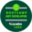
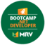

# Bootcamp

    
    
    
    

## Conteúdo
* Estrutura de dados
* Banco de dados
* Linux
* Git
* TDD
* Linguagem
    * Shell
    * Java
        * Spring Boot
* Arquitetura de sistemas
* Deploy

## Referência
### Livro
* Lógica de programação: a construção de algoritmos e estruturas de dados
* Linux: A Bíblia
* Controlando versões com Git e GitHub
* Sistemas de Banco de Dados by Navathe
* [Um guia definitivo para o Scrum](https://www.scrumguides.org/docs/scrumguide/v1/scrum-guide-portuguese-br.pdf)
* HTML5 e CSS3 domine a web do futuro 
* JavaScript O guia definitivo by David Flanagan
* Fundamentos da Programação de Computadores: Algoritmos, Pascal, C, C++ e Java
* Java Como Programar by Paul Deitel Harvey Deitel
* Vire o jogo com Spring Framework
* Ruby - Aprenda a programar na linguagem mais divertida
* Desenvolvimento web com ASP.NET MVC by Fabrício Sanchez, Márcio Fábio Althmann
* Scrum Gestão ágil para projetos de sucesso

### Github
* [Java: Collections](https://github.com/wesleyfuchter/collections-course)